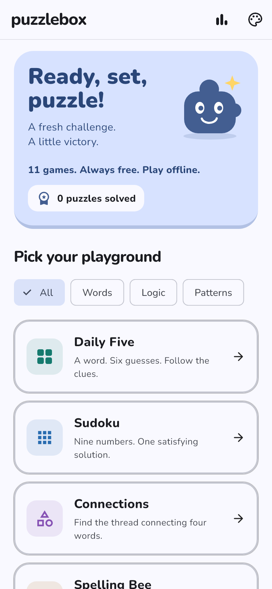
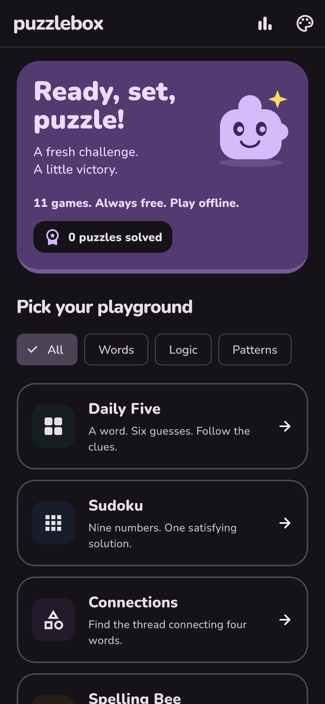

# Puzzlebox

Eleven offline puzzle games. Unlimited play, free hints, local progress, and four color themes. No ads, subscriptions, accounts, energy meters, or paid puzzle packs.

## Download for Android

**[Download the latest Puzzlebox APK](https://github.com/shuaib-mk/puzzlebox/releases/latest/download/puzzlebox.apk)**

[All releases and checksums](https://github.com/shuaib-mk/puzzlebox/releases)

Open the APK on Android and allow installation from your browser or file manager when Android asks. The release is signed with a dedicated Puzzlebox key. An older prototype signed with a debug key cannot be updated in place with this release; Android treats the signatures as different. Do not delete an old installation without first considering its locally stored progress.

<p>
  
  
</p>

## Release status

Version 2.1.0 improves gameplay persistence, undo, dictionary acceptance and visual design. See [release readiness](docs/RELEASE_READINESS.md) for verified coverage and the remaining Google Play steps. A successful build is not a zero-bug or Play Store approval guarantee.

## Play

- **Daily Five:** six guesses, duplicate-letter feedback, real word validation, position hints, and optional hard-mode clue enforcement.
- **Sudoku:** fresh uniquely solvable boards, difficulty presets, pencil notes, undo, conflict feedback, and timer.
- **Connections:** four disjoint groups sampled from an original category bank, one-away feedback, category hints, and mistake limits.
- **Spelling Bee:** seven-letter sets with a guaranteed pangram, center-letter and dictionary validation, scoring, shuffle, and difficulty-dependent goals.
- **The Mini / Crossword:** generated crossing-word layouts, consistent clues, direction switching, check, reveal-letter hints, undo, and timer.
- **Strands:** themed paths covering all 48 cells, a spanning theme word, winding paths, adjacency enforcement, hints, and undo.
- **Pips:** solvable domino sum-matching, reusable placement controls, undo, and target hints.
- **Tiles:** generated matching pairs, combos, and pair-location hints.
- **Letter Boxed:** real-word chains using all twelve letters, alternating-side rules, linked words, verified solutions, hints, and undo.
- **Vertex:** generated degree-constraint graphs, removable edges, undo, and a known-solution hint route.

Unlimited is the default. Completion saves the result and moves on after brief feedback. Next is always available. Daily challenges have separate statistics. Progress and settings stay on the device. Open the palette button for themes, settings, and game rules.

## About generation

Unlimited means no level cap, not an infinite supply of never-repeated content. Logic games generate new arrangements. Word games recombine finite, bundled words, clues, and themes; content can eventually repeat. No external service or AI subscription is required.

These are Puzzlebox's own implementations. Crossword uses compact crisscross layouts rather than newspaper-style symmetric, fully checked grids. Pips uses sum targets; Vertex uses degree constraints. Sudoku difficulty changes clue targets (44 / 35 / 28 where uniqueness permits), not a calibrated human-technique rating.

## Development

Validated with Flutter 3.44.8 / Dart 3.12.2. The app uses Riverpod 2 and SharedPreferences. This checkout did not contain Hive or a Supabase backend. The app therefore runs entirely locally; no server credentials are required.

```sh
flutter pub get
flutter analyze
flutter test
flutter run
```

To create a signed release, provide an ignored `android/key.properties`:

```properties
storePassword=YOUR_PRIVATE_PASSWORD
keyPassword=YOUR_PRIVATE_PASSWORD
keyAlias=puzzlebox
storeFile=puzzlebox-release.jks
```

Place the matching private keystore in `android/app/`, then run `flutter build apk --release`. Keep the same private signing key for future updates. **Never commit the keystore or passwords.** The release key and properties for this build are retained in the local project and excluded from Git.

The visual test writes review screenshots into a sibling `previews/` folder. It loads the bundled fonts and Material icon font, so it does not need online font services.

- [Architecture](docs/ARCHITECTURE.md)
- [Feature and verification checklist](docs/FEATURES.md)
- [Design system](docs/DESIGN.md)
- [Privacy](docs/PRIVACY.md)

Roboto is bundled for consistent offline typography; its license is in `assets/fonts/roboto_license.txt`. Existing word-list assets from the supplied project were retained.
